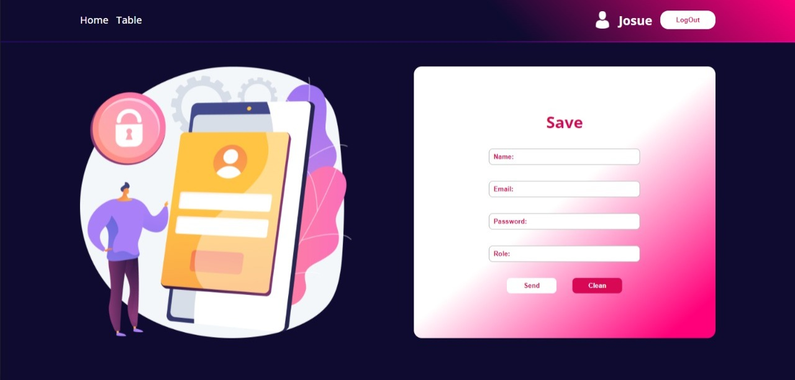
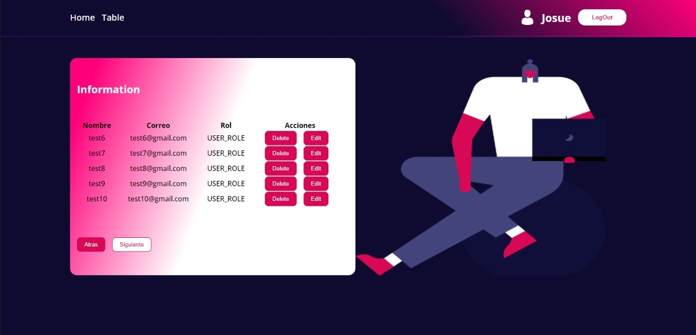

# CRUD login

CRUD Using JWT to login
 

# Run this proyect

npm install to add node modules and libraries - npm start to run this proyect

This project has been made using React JS & different technologies in the front end and Node JS, express & Mondo DB in the back end. 
 
The CRUD Login App uses Context API to handle the global state of the auth. 
 
It has different validations to prevent the User from performing an incorrect interaction with the application.
 
It has interaction with the localStorage of the browser. that means when you close your browser or reload the page your session will be still active, to log out you have to click on the log out button
 

If you have not log in the app will not let you join to any route
 
You can create,read,update,delete a user if you first have log in
 
You have a pagination in the table to see all the records
 
If you do not write well a url of the page it will send you to a 404 page
 
Note: to delete you will need to have ADMIN_ROLE in the DB
 

- React JS
- React Router v6
- Context API
- Hooks
- CSS
- BEM CSS methodology
- Node JS
- MongoDB
- Express
- Mongoose
- Validations in the front end and back end

Link: https://crud-login-auth.netlify.app/
 
Back end code: https://github.com/Josuelee/Rest-Server

## Take a look at the proyect:

